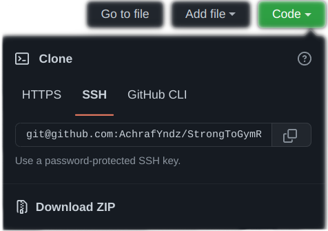

# StrongToGymRun

Convert all your Strong data to GymRun.


## Installation

Open the terminal and run:

```bash
git clone https://github.com/YAchrafY/StrongToGymRun.git
```

Or alternatively, press the green "Code" button in the top right corner and select "Download ZIP", then extract the .zip
file in your preferred working directory.



## Usage

On your phone, open the Strong app. Go to settings and click the "Export data" button. This will export a csv file
containing all your workout data. Put this csv file in `csv_input/`. **Make sure** you name it `myStrongData.csv`.

Now simply run `main.py` and it will output a new csv file with the name `out.csv`. Next, launch the GymRun app. Click
on "More" and then "Backup". Here you will find multiple ways to import/export data. We want to import using `CSV (Entries)`. Finally select the `out.csv` file we just generated, and all your Strong data should be imported!

## FAQ

Help, it says it could not find a translation entry for [ExerciseName]. What now?

- Simply open the file `exercise_name_conversion.py` and add your exercise to the dictionary in following convention:
  

Help, my exercise does not exist in GymRun. What do I do?

- Unfortunately, this is out of of my control. While you can add exercises into the GymRun app, the parser still won't
  recognize them. This is a mistake on GymRun's part. Your best bet would be to choose the closest exercise to it.
